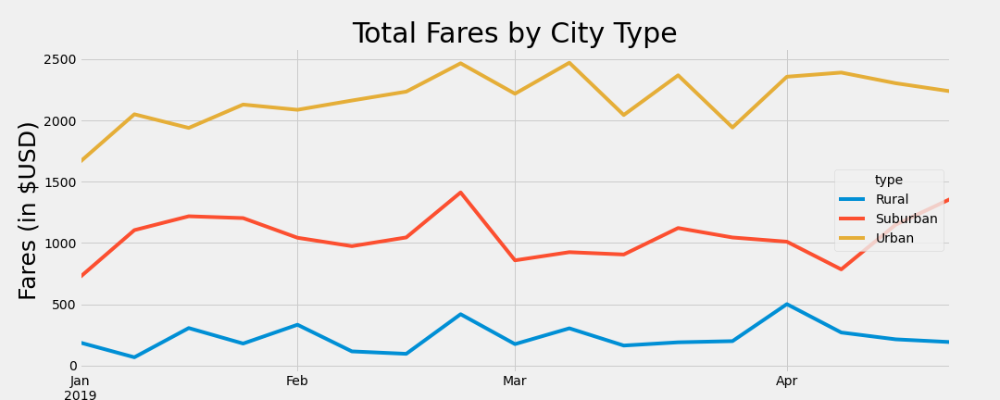

# PyBer_Analysis
Visualizing ride-share data using MatPlotLib

## Resources Used
- Data Source: city_data.csv, ride_data.csv
- Software: Python 3.9, Visual Studio Code, Jupyter Notebook

## Overview of the analysis: 
My boss has given me and Omar a brand-new assignment. Using our Python skills and knowledge of Pandas, we created a summary DataFrame of the ride-sharing data by city type. Then, using Pandas and Matplotlib, we created a multiple-line graph that shows the total weekly fares for each city type.

This new assignment consists of two technical analysis deliverables and a written report to present my results. I will submit the following:

  * Deliverable 1: A ride-sharing summary DataFrame by city type
  * Deliverable 2: A multiple-line chart of total fares for each city type
  * Deliverable 3: A written report for the PyBer analysis (README.md)

## Results: Using images from the summary DataFrame and multiple-line chart, describe the differences in ride-sharing data among the different city types.

We initially used the data from city_data and ride_data.csv to create a new DataFrame with the data we wanted to visualize. We wanted to separate data by type of location (Rural, Suburban, and Urban) and get the Total Rides, Total Drivers, Total Fares, Average Fare per Ride, and Average Fare per Driver for each location. 

Once we had this new DataFrame set up, we wanted to create a pivot table with the date as the index so we could get the total fares for each type of city by the date. Next, we created a new DataFrame so we only had the data from January 1st, 2019 through April 29th, 2019. This is the time frame we wanted to analyze. Lastly, we resampled this DataFrame to get the sum of the fares by week, which allowed our data to be visualized in the line graph below.

## Summary: Based on the results, provide three business recommendations to the CEO for addressing any disparities among the city types.

# The written analysis has the following:

## Overview of the analysis:

The purpose of the new analysis is well defined. (3 pt)

## Results:

There is a description of the differences in ride-sharing data among the different city types. Ride-sharing data include the total rides, total drivers, total fares, average fare per ride and driver, and total fare by city type. (7 pt)

## Summary:

There is a statement summarizing three business recommendations to the CEO for addressing any disparities among the city types. (4 pt)
  
