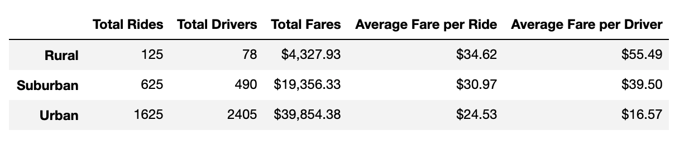

# PyBer_Analysis
Visualizing ride-share data using MatPlotLib

Use your repository README file to write your analysis of how to address any disparities in the ride-sharing data among the city types.

## Overview of the analysis: 
My boss has given me and Omar a brand-new assignment. Using our Python skills and knowledge of Pandas, we created a summary DataFrame of the ride-sharing data by city type. Then, using Pandas and Matplotlib, we created a multiple-line graph that shows the total weekly fares for each city type.

## Results: Using images from the summary DataFrame and multiple-line chart, describe the differences in ride-sharing data among the different city types.

We initially used the data available to create a new DataFrame with the data we wanted to visualize. 

## Summary: Based on the results, provide three business recommendations to the CEO for addressing any disparities among the city types.

# The written analysis has the following:

## Overview of the analysis:

The purpose of the new analysis is well defined. (3 pt)

## Results:

There is a description of the differences in ride-sharing data among the different city types. Ride-sharing data include the total rides, total drivers, total fares, average fare per ride and driver, and total fare by city type. (7 pt)

## Summary:

There is a statement summarizing three business recommendations to the CEO for addressing any disparities among the city types. (4 pt)
